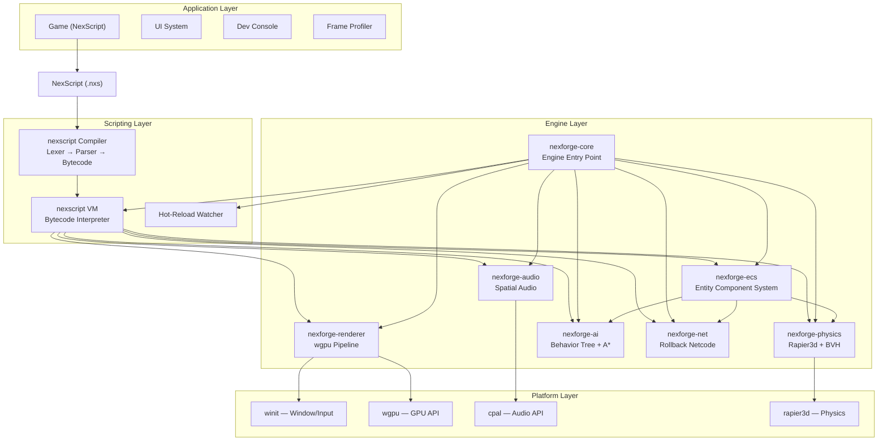
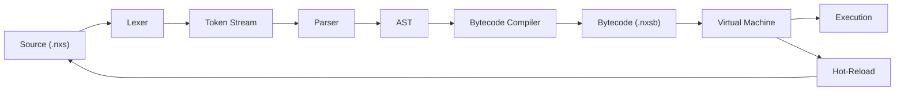
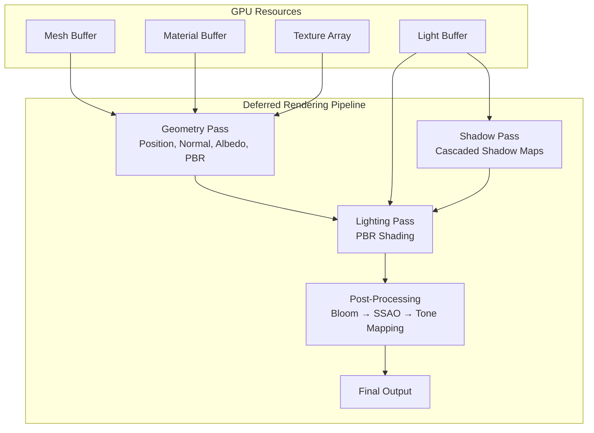
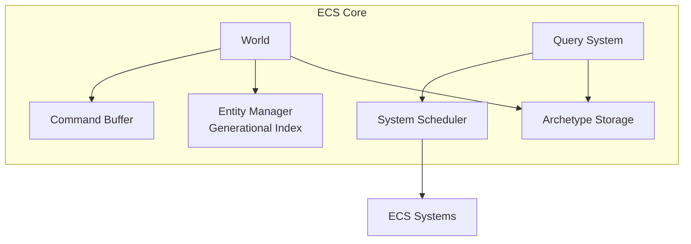
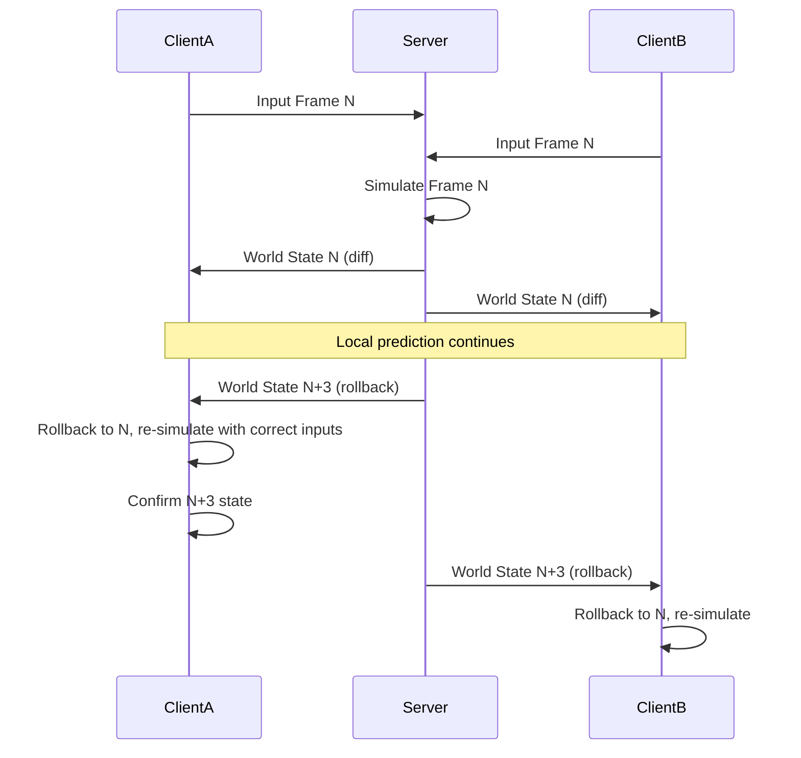
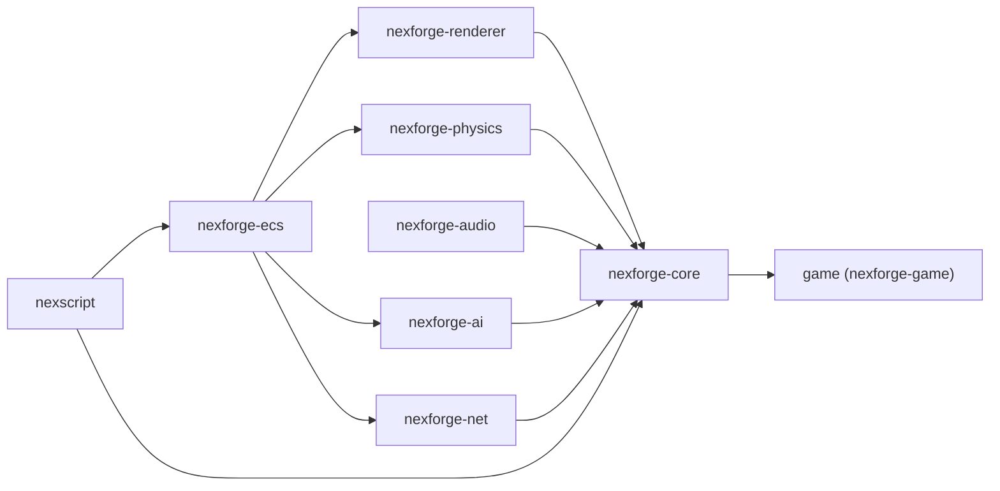
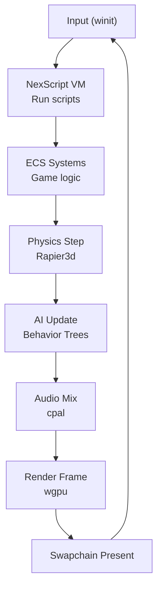
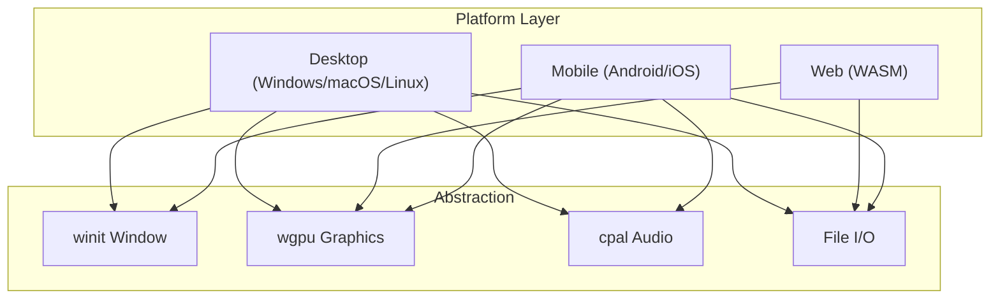
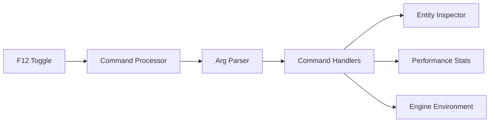
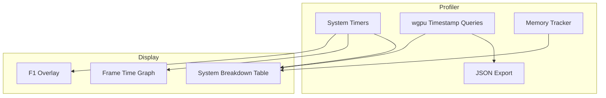

# Nexforge Engine Architecture

**Version:** 0.1.0 (Draft)

---

## 1. High-Level Architecture



---

## 2. NexScript Compiler & VM Pipeline



---

## 3. Rendering Pipeline



---

## 4. ECS Architecture



### 4.1 Archetype Layout

```
Archetype: (Transform, RigidBody, Health)
┌────────┬────────────┬──────────┬──────┐
│ Entity │ Transform  │ RigidBody│Health│
├────────┼────────────┼──────────┼──────┤
│    0   │ T0         │ RB0      │ H0   │
│    1   │ T1         │ RB1      │ H1   │
│    2   │ T2         │ RB2      │ H2   │
│  ...   │ ...        │ ...      │ ...  │
└────────┴────────────┴──────────┴──────┘
```

Columns are contiguous arrays for cache-friendly iteration.

---

## 5. Networking Model (Rollback)



---

## 6. Module Dependency Graph



All crates depend on `nexforge-ecs` for component definitions. The game binary depends on all engine crates via `nexforge-core`.

---

## 7. Data Flow Per Frame



**Performance Budget Per Frame (16.6ms total):**

| Stage          | Budget    |
|----------------|-----------|
| NexScript VM   | < 0.1ms  |
| ECS Systems    | < 1ms    |
| Physics        | < 4ms    |
| AI             | < 1ms    |
| Audio          | < 1ms    |
| Render         | < 8ms    |
| Buffer         | ~1.5ms   |

---

## 8. Platform Abstraction



---

## 9. Dev Console Architecture



Commands: `spawn`, `set_gravity`, `teleport`, `god_mode`, `list_entities`, `set_time_scale`.

---

## 10. Profiler Architecture



---

## 11. File Layout

```
nexforge-engine/
├── .github/workflows/       ← CI/CD pipelines
├── crates/
│   ├── nexscript/           ← Lexer, Parser, AST, Bytecode Compiler, VM
│   ├── nexforge-ecs/        ← World, Entity, Component, Query, Scheduler
│   ├── nexforge-renderer/   ← Pipeline, PBR, Shadow, Post-process, Shaders
│   ├── nexforge-physics/    ← Rapier3d integration, BVH, Character Controller
│   ├── nexforge-audio/      ← cpal output, HRTF, Audio Bus
│   ├── nexforge-ai/         ← Behavior Tree, A*, NavMesh, Utility AI
│   ├── nexforge-net/        ← Rollback, Deterministic Sim, WebRTC/UDP
│   └── nexforge-core/       ← Engine entry, System scheduler, Platform layer
├── game/
│   ├── src/                 ← Game binary (main.rs)
│   ├── scripts/             ← NexScript game logic files
│   └── assets/              ← Models, textures, audio
├── tools/
│   ├── dev-console/         ← In-game dev console tooling
│   ├── profiler/            ← Frame profiler
│   └── nexscript-lsp/       ← Language Server Protocol for NexScript
└── docs/                    ← Specifications and architecture docs
```

---

## 12. Key Design Decisions

| Decision                    | Choice                    | Rationale                                 |
|-----------------------------|---------------------------|-------------------------------------------|
| Graphics API                | WebGPU (wgpu)             | Cross-platform, future-proof, safe        |
| ECS Storage                 | Archetype-based           | Cache-friendly, O(1) query                |
| Physics                     | Rapier3d + Custom BVH     | Battle-tested foundation + custom perf    |
| Scripting                   | Custom bytecode VM        | Deterministic, embeddable, hot-reloadable |
| Networking                  | Rollback netcode          | GGPO-style for responsive multiplayer     |
| Audio                       | cpal + HRTF               | Cross-platform, low-latency               |
| Windowing                   | winit                     | Pure Rust, cross-platform                 |
| Serialization               | bincode + serde           | Compact binary, fast                      |
| Error Handling              | thiserror                 | Idiomatic Rust error types                |
| Build System                | Cargo workspace           | Native Rust, fast incremental builds      |
